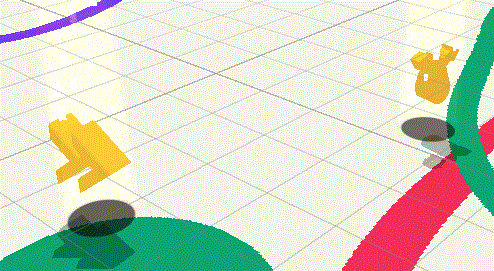
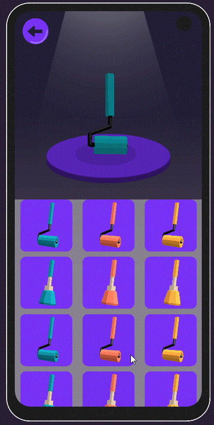
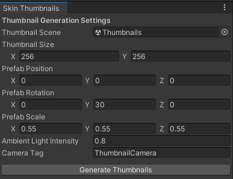

# Patch Notes

Ce document résume les ajouts, améliorations et correctifs intégrés au projet.

---

## 1) Nouveau game mode : **InfiniteMode / BoosterMode**

- Ajout d’un second mode de jeu : **"InfiniteMode"** (aka **"BoosterMode"**).
- **MainMenuView**
  - Ajout d’un nouveau bouton intégré dans un **HorizontalLayoutGroup** pour pouvoir l’afficher / le cacher facilement.
  - Reprise du système existant de **teinte d'image via le skin favori** pour ce bouton.
  - Ajout d’un texte affichant la **progression du joueur** dans ce mode.
- **GameService**
  - Ajout d’un booléen pour traquer si on joue en mode **Infini**.
- **PlayerPrefs**
  - Ajout d’un champ pour enregistrer **le niveau maximum atteint** dans ce mode.
- **Validation de niveau**
  - Ajout d’une condition de validation :
    - Le niveau est validé si le joueur arrive dans le **Top X** du niveau.
    - **X** est paramétrable dans `GameConfig`.
- **GameLoop**
  - Modification permettant d’enchaîner **directement** sur le niveau suivant.

---

## 2) Nouveaux power-ups : **IncreaseSpeed** & **RandomPaintBomb**

- Import des **FBX fournis**.
- Implémentation en repartant des bases existantes (**PaintBomb** et **SizeUp**).
- Intégration au système actuel :
  - **ScriptableObjects**
  - **Prefabs**
- **RandomPaintBomb**
  - Extraction / remontée dans `TerrainController` de la logique de spawn aléatoire déjà utilisée par les power-ups.

### Aperçu (Power Ups)

---

## 3) Set de boosters prédéfinis par niveau

- Ajout d’un système permettant d’assigner un **set de boosters par niveau** dans `GameConfig`.
- Ajout d’un package externe pour la **serialization de dictionnaires** afin de faciliter le paramétrage.

---

## 4) Nouvelle vue UI : **Skin Selection**

- Création d’une nouvelle vue de sélection de skin.
- Intégration avec les éléments graphiques déjà présents dans le projet.
- Mise en place d’un **pooling de cellules** basé sur le `GridLayoutGroup` pour optimiser l’affichage d’une longue liste.
  - Ajustement de la taille des cellules.
  - Limitation du nombre de cellules affichées simultanément.
  - **TODO**
    - Sous-classer `GridLayoutGroup` pour extraire la logique de pooling / réutilisation dans une classe dédiée.

### Aperçu (Pooling UI)

---

## 5) Editor Tool : **Génération de thumbnails de skins**

- Création d’un outil d’éditeur pour générer automatiquement les images des skins.
- Nouvelle scène **`Thumbnails`**
  - Contient une **Camera** dédiée pour instancier les prefabs de skins.
- Fonctionnement :
  - Au clic sur le bouton de génération :
    1. Chaque `Skin ScriptableObject` est instancié devant la caméra.
    2. Une image est générée depuis la **RenderTexture**.
    3. L’image est sauvegardée dans :
       - `Resources/Skins/Thumbnails`
    4. Ces thumbnails sont ensuite réutilisés dans la `SkinSelectionView`.

### Aperçu (Thumbnail Generator)

- Réutilisation du système du MainMenu pour afficher un **aperçu 3D du brush/skin sélectionné**.

---

## 6) Nouvelle vue Debug (simple)

- Création d’une vue UI de debug avec **2 toggles** :
  - **Skin Selection**
  - **Infinite Mode**
- Détection de geste :
  - Ajout d’une classe customisable de **MultiTap / MultiFingers**.
  - Ouverture de la vue Debug depuis le MainMenu lors d’un :
    - **triple tap + 4 doigts**.
- Service Debug :
  - Ajout d’un service `Debug` pour enregistrer les **PlayerPrefs** liés aux toggles.
- Activation dynamique :
  - Boutons/features **Infinite Mode** et **Skin Selection** activés/désactivés selon les PlayerPrefs.

---

## 7) Correctifs

- **Couleur favorite**
  - La couleur favorite semblait être appliquée **avant** d’avoir été enregistrée dans le service de stats.
- **Android vibration**
  - `AndroidVibration.vibrate()` sans argument provoquait une exception sur device Android.
  - Correctif appliqué.

---
